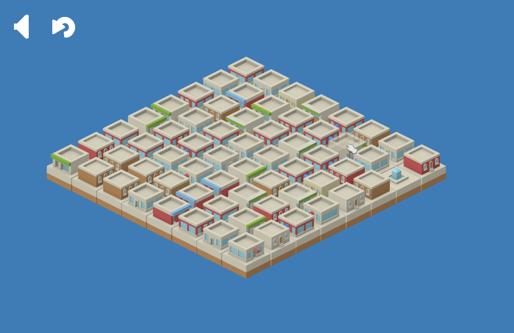

Menhir
=====
Menhir is a simple puzzle game.

**WARNING: THIS IS NOT PRODUCTION QUALITY CODE.**

**Powered by [Fz2D](https://github.com/icebreaker/fz2d).**

Contribute
----------
* Fork the project.
* Make your feature addition or bug fix.
* Do **not** bump the version number.
* Send me a pull request. Bonus points for topic branches.

Credis
------
All *assets* by [Kenney "Asset Jesus"](http://kenney.nl).

* [Isometric Buildings #1](http://opengameart.org/content/isometric-buildings-1)
* [Game Icons](http://opengameart.org/content/game-icons)
* [UI Pack: Space Extension](http://opengameart.org/content/ui-pack-space-extension)
* [Kenney Fonts](http://opengameart.org/content/kenney-fonts)
* [85 Short Music Jingles](http://opengameart.org/content/85-short-music-jingles)

License
-------
Copyright (c) 2016, Mihail Szabolcs

Menhir is provided **as-is** under the **MIT** license. 
For more information see LICENSE.
